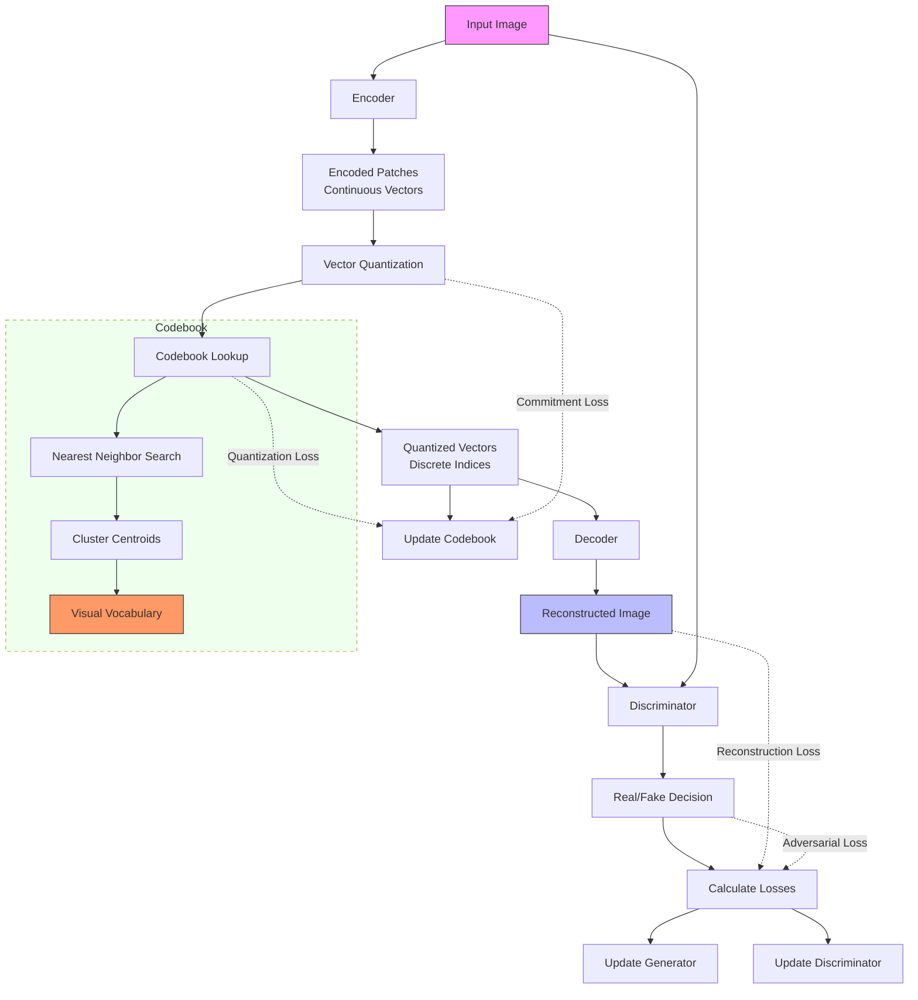

# VQgan

```mermaid
flowchart TD
    %% Main Flow
    A[Input Image] --> B[Encoder]
    B --> C[Encoded Patches\nContinuous Vectors]
    C --> D[Vector Quantization]
    D --> E[Codebook Lookup]
    E --> F[Quantized Vectors\nDiscrete Indices]
    F --> G[Decoder]
    G --> H[Reconstructed Image]
    H --> I[Discriminator]
    A --> I
    
    %% Training Components
    I --> J[Real/Fake Decision]
    J --> K[Calculate Losses]
    K --> L[Update Generator]
    K --> M[Update Discriminator]
    F --> N[Update Codebook]
    
    %% Codebook Visualization
    subgraph Codebook
        E --> O[Nearest Neighbor Search]
        O --> P[Cluster Centroids]
        P --> Q[Visual Vocabulary]
    end
    
    %% Loss Functions
    D -.->|Commitment Loss| N
    E -.->|Quantization Loss| N
    H -.->|Reconstruction Loss| K
    J -.->|Adversarial Loss| K
    
    %% Styling
    style A fill:#f9f,stroke:#333
    style H fill:#bbf,stroke:#333
    style Q fill:#f96,stroke:#333
    style Codebook fill:#efe,stroke-dasharray:5
```
