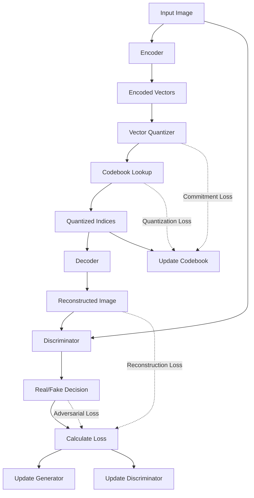

# VQGAN: Vector Quantized Generative Adversarial Networks


## What is VQGAN?

VQGAN combines a Vector Quantized Variational Autoencoder (VQ-VAE) with a GAN to create high-quality images. In simple terms:

- It **compresses** images into a discrete "visual vocabulary"
- It **learns** what makes images look realistic
- It can **generate** new high-quality images from this vocabulary

Think of it like having Lego blocks for images - VQGAN learns which blocks to use and how to arrange them to build realistic pictures!

## 📚 Table of Contents

- [Simple Visual Overview](#simple-visual-overview)
- [Core Components](#core-components)
  - [Generator (The Image Creator)](#generator-the-image-creator)
  - [Discriminator (The Quality Checker)](#discriminator-the-quality-checker)
- [Examples and Results](#examples-and-results)

## Simple Visual Overview



## Core Components

### Generator (The Image Creator)

The Generator has three main parts:

#### 1. Encoder: Compresses the Image

The Encoder is like a camera that takes an image and creates a compact representation:

**Example**: A 256×256 image gets compressed to a 32×32 grid of features.

```
Original Image (256×256×3) → [Encoder] → Feature Map (32×32×256)
```

Key characteristics:
- Uses convolutional layers to detect image features
- Progressively downsamples the image (makes it smaller)
- Captures essential information while discarding redundancies

#### 2. Vector Quantizer: Creates a Visual Dictionary

The Vector Quantizer is the magic that makes VQGAN special! It:

- Maintains a "codebook" of visual features (like a visual dictionary)
- Maps each encoded feature to the closest entry in the codebook
- Replaces continuous values with discrete "visual words"

**Example**: If your codebook has 1024 entries, it's like having 1024 different visual words.

```
Feature Vector: [0.2, 0.7, 0.1] → Find closest codebook entry → [0.25, 0.7, 0.05]
```

##### The CodeBook


*Learned CodeBook*

What you're seeing is essentially the visual vocabulary that VQGAN has learned during training. The codebook is a fundamental component of how VQGAN works:

1. Each colored grid (or "code") represents a distinct pattern or feature that the model has learned to recognize in images
2. The colors represent different activation values for the features
3. These 16 codes are just a small sample - a full VQGAN codebook typically contains hundreds or thousands of these patterns

When VQGAN processes an image:
- The encoder transforms image regions into vectors
- The Vector Quantizer finds the closest matching pattern from this codebook
- The decoder uses these codebook entries to reconstruct the image

What Each Code Represents:
- Low-level features: Edges, textures, color gradients (Codes 0-3)
- Mid-level patterns: Curves, geometric shapes (Codes 4-7)
- High-level components: Object parts (eyes, leaves), textures (fur, wood grain) (Codes 8-15)

This process is similar to how we might represent colors - instead of using infinite RGB values, we might map them to a fixed palette of common colors.

#### 3. Decoder: Rebuilds the Image

The Decoder takes the quantized representation and reconstructs the full image:

```
Quantized Feature Map (32×32×256) → [Decoder] → Reconstructed Image (256×256×3)
```

Key characteristics:
- Mirrors the encoder in reverse
- Gradually upsamples the representation back to full resolution
- Transforms discrete codes back into visual content

### Discriminator (The Quality Checker)

The Discriminator is the critic that helps improve image quality:

- Looks at patches of the image (not the whole image)
- Gives feedback on which parts look real vs. fake
- Pushes the Generator to create more realistic details

**Example**: Think of the Discriminator as an art critic who points out issues like:
- "The texture of this skin doesn't look realistic"
- "The lighting in this corner isn't consistent"
- "The edges of these objects are too blurry"

## How It All Works Together

1. **Training Loop Example**:
   ```
   1. Take an image of a cat
   2. Encoder compresses it
   3. Quantizer maps to discrete codes
   4. Decoder reconstructs the cat image
   5. Discriminator compares with real cat images
   6. Model improves based on feedback
   ```

2. **Generation**:
   ```
   1. Start with random codes from the codebook
   2. Decoder transforms them into an image
   3. Get a completely new cat image!
   ```


## Examples and Results


*Epoch 0*


*Epoch 5*


*Epoch 10*


*Epoch 15*

### Reconstruction Example


---

## 📚 Credits

This implementation is based on the paper:

* [**"Taming Transformers for High-Resolution Image Synthesis"**](https://arxiv.org/abs/2012.09841) by Esser et al.

Additional helpful resource:

* [**"Generating Images with VQGAN + CLIP"**](https://ljvmiranda921.github.io/notebook/2021/08/08/clip-vqgan/) by **LJ Miranda** — A beginner-friendly, intuitive explanation of how VQGAN and CLIP work together for text-to-image generation.

---

## 👤 Author

For any questions or issues, please open an issue on GitHub: [@Siddharth Mishra](https://github.com/Sid3503)

---

<p align="center">
  Made with ❤️ and lots of ☕
</p>
